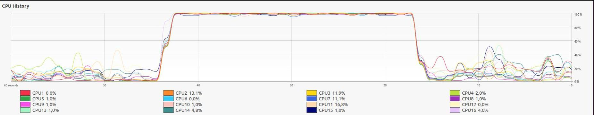

# ZMQ client-server for parallel image processing(resize).

This program is an example of parallel programming with zeromq(for workers syncrhonization). it allows to apply a set of operations on images such as resize, to_gray, threshold, or flip.

We have a client-server architecture (see https://zguide.zeromq.org/docs/chapter3/), the clients are workers who will process the images, each worker can request a task from the server. A worker cannot execute several tasks at the same time, which makes it possible to have a balanced system in terms of load.

# cpu usage (parallel zeromq image processing)

<table align="center">
    <tr><td align="center" with="800px"></td></tr>
</table>

# benchmark

- sequential-processing Flickr8k image dataset

```bash
    2022-09-28 10:11:11,714 - image-logger - INFO: server has processed 8090/8091 images in 224s
```

- parallel-processing(zeromq ROUTER-DEALER) Flickr8k image dataset

```bash
    2022-09-28 10:13:15,137 - image-logger - INFO: server has processed 8091/8091 images in 026s
```

# code organization

- main.py
  - this file is the entrypoint
  - it exposes two modes(sequential-processing, parallel-processing)
  - use **python main.py --help**  to see availables subcommands
- worker.py
  - this file contains the implementation of the zeromq worker
  - each worker has two sockets(dealer and subscriber)
  - the dealer socket will be used for async communcation between server and worker
  - the subscriber socket allows the server to be able to broadcast messages such as (KILL SIGNAL)

# initilization

```bash
    # create virtual env 
    python -m venv env 
    # activate virutal env 
    source env/bin/activate 
    # upgrade pip 
    pip install --upgrade pip 
    # install dependencies 
    pip install -r requirements.txt
```

# run the programm

## helper

```bash
    # main help
    python main.py --help 
    # sequential mode help
    python main.py sequential-processing --help
    # parallel mode help 
    python main.py parallel-processing --help 
```

## This program has two modes :

- sequential mode
  ```bash
      python main.py sequential-processing 
          --path2initial_images /path/to/source/images 
          --path2resized_images /path/to/target/images 
          --image_extension '*.jpg' 
          --size 512 512
  ```
- parallel mode
  ```bash
      python main.py parallel-processing 
          --path2initial_images /path/to/source/images 
          --path2resized_images /path/to/target/images 
          --image_extension '*.jpg' 
          --nb_workers 8 
          --size 512 512
  ```
